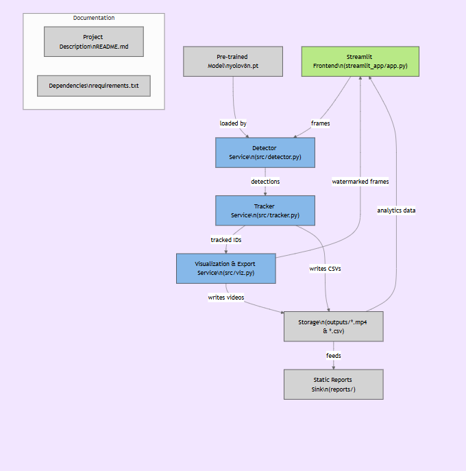
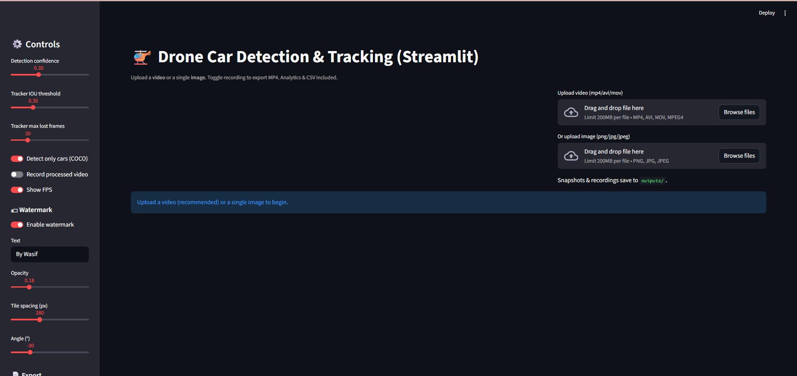
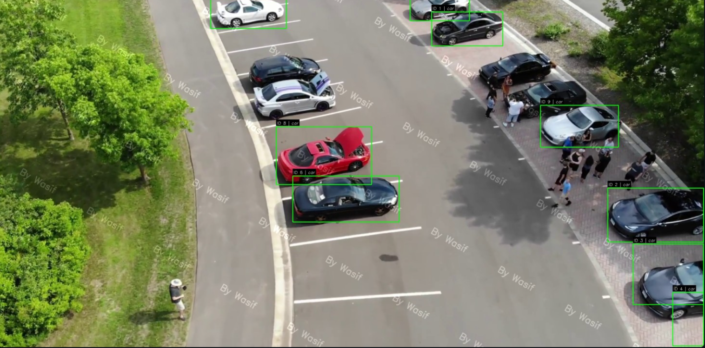

# 🚁 AeroVision-AI  
### _Intelligent Aerial Vehicle Detection, Tracking & Analytics System_

> ✨ **AeroVision-AI** is a next-generation **aerial intelligence framework** built to understand the world from above.  
> It leverages the power of **YOLOv8**, **OpenCV**, and **Streamlit** to perform real-time **vehicle detection**, **object tracking**, and **data-driven analytics** on drone-captured footage — turning raw aerial video into meaningful, structured insight.

---

## 🧠 What It Does

AeroVision-AI goes far beyond traditional detection scripts — it acts as a **complete end-to-end visual intelligence system**.  
Using deep learning and advanced computer vision, it detects moving vehicles from drone footage, tracks them persistently with unique IDs, and generates **interactive, analytics-rich visualizations** that can be exported as videos, snapshots, and structured CSV reports.

The system is designed with a **research-grade backbone** and a **presentation-ready frontend**, allowing users to seamlessly explore data while maintaining production-level polish.

---

## 🚀 Key Idea

The core philosophy behind AeroVision-AI is simple yet powerful:  
> “Transform every aerial frame into an intelligent data point.”

Whether you’re analyzing parking lots, inspecting road traffic, monitoring events, or studying autonomous driving patterns — AeroVision-AI captures, interprets, and quantifies movement in a way that feels effortless and visually engaging.

---

## 🧩 Why It Stands Out

💡 **Deep Intelligence** — Built on **YOLOv8**, AeroVision-AI ensures high accuracy across diverse aerial angles, altitudes, and lighting conditions.  
🧭 **Persistent Tracking** — Each vehicle is tracked with consistent IDs, making it ideal for time-based analytics and behavioral observation.  
📊 **Analytics-Driven Design** — Every frame contributes to measurable insights — detections, counts, movement trends, and positional data — stored neatly in exportable CSVs.  
🎨 **Streamlit-Powered UI** — A beautifully minimal, fully interactive interface to control confidence thresholds, IOU settings, watermark styling, and video recording — no coding needed.  
💧 **Dynamic Watermark Layer** — Add your own branded watermark that tiles, rotates, and blends naturally into each processed frame.  
📦 **Research & Reporting Ready** — Perfect for demonstrations, traffic analysis, surveillance research, or AI showcase projects.  

---

## 🌍 The Vision

In a world where drones capture terabytes of video every day, **AeroVision-AI** turns those pixels into purpose.  
It empowers developers, researchers, and organizations to **see patterns in motion**, quantify behavior, and build smarter aerial ecosystems.

Through intelligent automation and elegant visualization, AeroVision-AI redefines how aerial data is perceived —  
from raw video… to **real-time visual intelligence**.  

---

> 🧩 **Built for innovation, designed for insight, and engineered for impact.**


## 📸 Project Overview

**AeroVision-AI** is more than just a car detection script — it’s a **complete aerial intelligence ecosystem** that brings drone footage to life through deep learning.  
At its core, the system can **detect, track, and analyze vehicles** in real time, transforming ordinary drone videos into rich visual data streams filled with actionable insights.

Using a combination of **YOLOv8**, **OpenCV**, and **Streamlit**, AeroVision-AI enables users to experience the power of aerial analytics through an intuitive interface and professional-grade outputs.

It empowers you to:
- 🛣️ **Monitor and analyze** traffic patterns, parking areas, or event zones from an aerial perspective  
- 🔢 **Automatically count and track** every detected vehicle with persistent IDs  
- 🎞️ **Export annotated videos** complete with bounding boxes and labeled tracks  
- 📊 **Generate detailed CSV analytics** for research, reporting, or data modeling  
- 💧 **Apply branded watermark overlays** to maintain visual ownership and authenticity  

In essence, AeroVision-AI bridges **drone vision and data intelligence**, turning raw footage into structured, insightful visual evidence for researchers, developers, and analysts alike.

---

## ⚙️ Core Features

| 🌟 Feature | 💡 Description |
|-------------|----------------|
| 🎥 **Real-time YOLOv8 Inference** | Utilizes the state-of-the-art YOLOv8 object detection model to identify vehicles across frames instantly with remarkable accuracy. |
| 🧭 **Intelligent Object Tracking** | Tracks every detected car persistently using an IOU-based tracker, ensuring consistent IDs and smooth temporal continuity across the video stream. |
| 📊 **Analytical Data Export** | Automatically logs detections into structured CSV files containing frame indices, bounding box coordinates, confidence levels, and class information. |
| 💧 **Dynamic Watermark System** | Add customizable, semi-transparent watermark layers with adjustable opacity, rotation, and spacing — ensuring secure and professional outputs. |
| 💾 **Video & Snapshot Recording** | Capture fully processed videos or individual frames as images — ideal for research presentations or academic reports. |
| 🧩 **Streamlit Interactive Dashboard** | A clean, user-friendly dashboard to upload footage, tweak parameters, and visualize results live — all without writing a single line of code. |
| ⚡ **Optimized Performance** | Efficient inference pipeline optimized for both GPU and CPU, allowing smooth operation even on modest setups. |
| 🧾 **Automated Output Management** | Each run is automatically organized into time-stamped folders, keeping all MP4, CSV, and snapshot outputs cleanly structured and easy to access. |

---

> 🧠 **In short:** AeroVision-AI transforms aerial visuals into measurable intelligence — making drones not just eyes in the sky, but analysts in motion.


## 🧩 Architecture Overview

The architecture of **AeroVision-AI** is designed with a clear goal — to create a **seamless, modular, and interpretable pipeline** that transforms raw drone footage into structured, visual, and analytical intelligence.  
Every layer of the system communicates efficiently, ensuring real-time inference, clean visualization, and effortless data export — all orchestrated within an elegant Streamlit interface.

<p align="center">
  
</p>

---

### 🧠 How It Works

At its core, the system follows a **modular service-based architecture**, where each component focuses on a distinct responsibility — from frame ingestion to analytics generation.  
This design not only ensures scalability and clarity but also allows developers and researchers to extend or replace modules with minimal effort.

---

### 🔹 **Detailed Data Flow**

1. 🖥️ **Streamlit Frontend (`streamlit_app/app.py`)**  
   Acts as the user interface and control center. Users upload drone footage or images, set detection thresholds, choose watermark preferences, and monitor outputs live.  

2. 🧠 **YOLOv8 Detector (`src/detector.py`)**  
   Processes each incoming frame using **YOLOv8**, performing real-time vehicle detection with high confidence and precision.  
   It outputs bounding boxes, class IDs, and confidence scores for each detected object.

3. 🧭 **Tracker Module (`src/tracker.py`)**  
   Uses an **IOU (Intersection over Union)**-based algorithm to maintain identity consistency across frames.  
   Each car receives a unique tracking ID, ensuring smooth object association even in overlapping or fast-moving scenes.

4. 🎨 **Visualization Engine (`src/viz.py`)**  
   Handles real-time drawing of bounding boxes, track IDs, and overlay elements such as FPS counters and watermark layers.  
   Ensures processed frames are both informative and presentation-ready.

5. 💾 **Export Services**  
   Captures processed frames and writes them as:
   - 🎥 Annotated videos (`.mp4`)
   - 📊 Analytics CSV logs (`.csv`)
   - 🖼️ Snapshots (`.png`)  
   All outputs are stored neatly in the `/outputs` directory, automatically organized by timestamp.

6. 📁 **Reporting & Analysis Layer (`/reports`)**  
   Aggregates key visualizations, architecture references, and summary snapshots that can be used for academic documentation, performance reports, or presentations.

---

### ⚙️ Architectural Principles

| Principle | Description |
|------------|-------------|
| 🧩 **Modularity** | Each function (detection, tracking, visualization) is isolated yet interconnected — easy to extend or upgrade individually. |
| ⚡ **Real-Time Performance** | The entire pipeline is optimized for live frame-by-frame inference without noticeable lag, even on CPUs. |
| 📈 **Traceability** | Every processed frame, detection, and track is stored and can be audited or analyzed later for reproducibility. |
| 💡 **Scalability** | New modules (e.g., multi-class detection, speed estimation) can be integrated with minimal code restructuring. |
| 🧾 **Transparency** | A clear, human-readable code structure allows researchers and developers to easily follow and explain each stage of the process. |

---

In summary, **AeroVision-AI’s architecture** is not just a collection of scripts —  
it’s a **living ecosystem of interconnected components**, purpose-built to bridge drone vision and data science.  
Each frame enters as raw imagery and exits as **interpretable intelligence**, ready for visualization, reporting, or further AI modeling.


## 🗂️ Directory Structure

AeroVision-AI follows a **clean, modular project structure**, ensuring clarity, scalability, and maintainability.  
Each directory serves a distinct role in the pipeline — from deep learning inference to visualization and reporting.

AeroVision-AI/
│
├── src/
│   ├── detector.py              # ⚙️ YOLOv8-based vehicle detection service
│   ├── tracker.py               # 🎯 IOU-based object tracking module
│   ├── viz.py                   # 🖼️ Frame drawing, watermarking & export utilities
│   └── __init__.py              # Initializes the src module
│
├── streamlit_app/
│   └── app.py                   # 🧩 Streamlit frontend for user interaction & visualization
│
├── outputs/                     # 💾 Automatically saved processed videos, CSVs, and snapshots
│
├── reports/                     # 📊 Stored screenshots, architecture diagrams, and performance visuals
│
├── models/
│   └── yolov8n.pt               # 🤖 Pre-trained YOLOv8 Nano model for inference
│
├── requirements.txt             # 📦 List of dependencies for environment setup
├── architecture.png             # 🧠 System architecture diagram (used in documentation)
└── README.md                    # 📘 Project documentation file

### 📁 Directory Purpose Summary

| 🗂️ **Folder / File** | 🧩 **Description** |
|------------------------|--------------------|
| **`src/`** | Core backend containing detection, tracking, and visualization logic. |
| **`streamlit_app/`** | Frontend layer for user uploads, parameter control, and live results display. |
| **`outputs/`** | Stores all generated outputs — annotated videos, CSV analytics, and saved frames. |
| **`reports/`** | Includes documentation visuals, screenshots, and research-ready figures. |
| **`models/`** | Houses pre-trained weights or custom model checkpoints for YOLOv8. |
| **`requirements.txt`** | Defines all project dependencies for environment setup. |
| **`architecture.png`** | High-level architecture overview diagram used in documentation. |
| **`README.md`** | The main project guide (this file). |

---

## 🧠 Tech Stack

**AeroVision-AI** leverages a **modern, efficient, and research-friendly technology stack**, blending the flexibility of Python with state-of-the-art AI libraries for computer vision, analytics, and UI development.

| 🧩 **Category** | ⚙️ **Technologies Used** | 🧠 **Purpose** |
|-----------------|--------------------------|----------------|
| 🎨 **Frontend / UI** | **Streamlit** | Builds an interactive dashboard for real-time visualization and parameter control. |
| 🤖 **Core ML Model** | **YOLOv8 (Ultralytics)** | Performs high-speed, high-accuracy vehicle detection in aerial frames. |
| 🧭 **Vision Processing** | **OpenCV**, **NumPy** | Handles image transformations, video frame operations, and pixel-level processing. |
| 🎯 **Tracking Engine** | **IOU-based Tracker** | Maintains consistent tracking IDs across frames for accurate motion analysis. |
| 📊 **Visualization Layer** | **Matplotlib**, **OpenCV** | Renders bounding boxes, tracks, FPS counters, and dynamic watermark overlays. |
| 📈 **Data Handling** | **CSV**, **Tempfile** | Stores analytical data, tracks detections, and supports file streaming. |
| ⚙️ **Backend Logic** | **Python 3.10+** | Provides overall orchestration, module integration, and environment compatibility. |

---

> 🧠 **In short:**  
> The AeroVision-AI tech stack is engineered for **speed, modularity, and interpretability**, making it ideal for research, prototyping, and real-world drone analytics.

## 🚀 Setup & Installation

Follow these steps to set up and run **AeroVision-AI** on your local machine.  
The setup process is designed to be simple, portable, and consistent across all operating systems.

---

### 🧩 1️⃣ Clone the Repository

Start by cloning the repository and navigating into the project directory:

git clone https://github.com/mwasifanwar/AeroVision-AI.git
cd AeroVision-AI

⚙️ 2️⃣ Create a Virtual Environment

Create and activate a virtual environment to keep dependencies isolated and clean:

# Create virtual environment
python -m venv .venv

# Activate (Linux / macOS)
source .venv/bin/activate

# Activate (Windows)
.venv\Scripts\activate


📦 3️⃣ Install Dependencies

Install all required Python packages using requirements.txt

pip install -r requirements.txt

This will automatically install the core dependencies:

🤖 YOLOv8 (Ultralytics) → Object detection engine

🧭 OpenCV → Video and image processing

🎨 Streamlit → Interactive dashboard framework

🧮 NumPy, Matplotlib → Numerical operations and visualization tools

🧠 4️⃣ Run the Streamlit App

Launch the application using Streamlit:
streamlit run streamlit_app/app.py


## 🎮 Usage

Using **AeroVision-AI** is straightforward — no coding required!  
Simply follow these steps inside the **Streamlit interface**:

---

### 🪶 Step-by-Step Workflow

1. **Launch the App**
   - Run the app using the command:
     ```bash
     streamlit run streamlit_app/app.py
     ```

2. **Upload Your Media**
   - 🎥 **Drone Videos:** `.mp4`, `.avi`, `.mov`  
   - 🖼️ **Still Images:** `.jpg`, `.jpeg`, `.png`

3. **Adjust Parameters**
   - 🔍 **Detection Confidence:** Filter out low-confidence predictions for cleaner results.  
   - 🎯 **IOU Threshold:** Tune the tracker’s sensitivity to maintain smoother and more consistent object IDs.  
   - 💧 **Watermark Settings:** Customize text, opacity, angle, and spacing to match your branding or report style.

4. **Start Detection**
   - Press **▶️ Start** to begin real-time inference and object tracking.  
   - The system processes frames dynamically, applying YOLOv8 detections and tracking IDs to each vehicle.

5. **Visualize Results Live**
   - Watch **detections, bounding boxes, IDs, and FPS counters** update frame-by-frame in real time on the Streamlit dashboard.  
   - Easily toggle between modes, adjust confidence levels, and fine-tune visualization without restarting.

6. **Export Outputs**
   - 💾 **Processed Video (.mp4):** Includes bounding boxes, track IDs, and optional watermark overlay.  
   - 📊 **Detections CSV (.csv):** Contains detailed analytics including frame index, object ID, class label, confidence score, and bounding box coordinates.  
   - 🖼️ **Snapshots (.png):** Saves static frames for documentation, research reports, or presentations.

---

## 📊 Output Samples

All generated visuals and analytical results from **AeroVision-AI** are automatically stored inside the `outputs/` folder after each session.  
Additionally, curated screenshots are placed in the `reports/` directory for documentation and research presentation.

---

### 🖼️ Example Outputs

| Example | Description |
|----------|-------------|
| 🖼️ `reports/01.png` | Drone overview showcasing multiple vehicles detected simultaneously using YOLOv8. |
| 🖼️ `reports/02.png` | Persistent **tracking** view — each vehicle maintains a unique ID across frames. |
| 🖼️ `reports/03.png` | Custom **watermark overlay** applied to ensure brand identity and professional presentation. |
| 🖼️ `reports/04.png` | **CSV-exported analytics preview** displaying structured detection and tracking data. |
| 🖼️ `reports/05.png` | Final **visualization snapshot**, ideal for reports, demonstrations, or publications. |

---

### 📸 Visual Preview

<p align="center">
  
</p>

<p align="center">
  <i>Example: Real-time vehicle detection and tracking from aerial footage using YOLOv8.</i>
</p>

<p align="center">
  
</p>

<p align="center">
  
</p>

## 📈 Analytics & Export

**AeroVision-AI** automatically logs every detection and tracking event into structured **CSV files**, enabling seamless analysis and post-processing.  
Each frame processed during video inference generates a corresponding entry that includes bounding box coordinates, object IDs, class labels, and confidence values.

---

### 🧮 CSV Output Structure

Each CSV file follows a standardized format for easy integration with **Python**, **Excel**, or **Power BI**:

| Frame | Track ID | Class | Confidence | X1 | Y1 | X2 | Y2 |
|--------|-----------|--------|-------------|----|----|----|----|
| 132 | 7 | car | 0.94 | 380 | 200 | 420 | 250 |

---

### 💡 How It Works
- For **every frame** in your uploaded video, **YOLOv8** performs object detection.  
- The **IOU-based tracker** assigns a **unique Track ID** to each vehicle and maintains its identity across frames.  
- The system records all detections into a **CSV** file, stored automatically in the `/outputs` folder.  
- The result is a **chronological detection log** that can be visualized, aggregated, or used for model fine-tuning and downstream analytics.

---

### 🧠 Why It’s Powerful

- ✅ **Quantitative Insight:** Transform raw drone footage into measurable data points.  
- ✅ **Versatile Integration:** Import CSVs into Python (Pandas), Excel, Tableau, or Power BI.  
- ✅ **Research-Ready:** Ideal for academic analysis, traffic pattern studies, or dataset creation.  
- ✅ **Automation Friendly:** Supports batch processing and consistent export structure.

> 📊 **Example Use Case:**  
> - Compute traffic density per frame.  
> - Plot vehicle trajectories over time.  
> - Generate heatmaps for congestion analysis.  

---

## 🌍 Future Enhancements

The roadmap for **AeroVision-AI** includes several planned upgrades to elevate functionality, performance, and scalability.  
These features aim to make the platform more powerful for both research and real-world deployments.

---

| Feature | Description |
|----------|-------------|
| 📦 **Speed Estimation** | Compute approximate vehicle speed using frame-to-frame position differentials and FPS data. |
| 🧭 **Zone Counting** | Define polygonal or rectangular regions in the video to count vehicle entry and exit events. |
| ☁️ **Web Deployment** | Deploy directly on platforms like **Hugging Face Spaces**, **Render**, or **Streamlit Cloud** for public demos. |
| 🔍 **Multi-Class Support** | Extend model capabilities beyond cars to include trucks, motorbikes, and pedestrians. |
| 🧠 **SHAP / LIME Explainability** | Integrate interpretability modules to visualize how the model makes decisions (explainable AI). |
| 📊 **Real-time Dashboard** | Add live analytical visualization (charts, graphs, traffic density meters) using **Plotly** or **Dash**. |

---

### 🚀 Planned Technical Extensions

1. **MLOps Integration:** Automate retraining pipelines using Docker + GitHub Actions.  
2. **Edge Optimization:** Quantize YOLOv8 for real-time deployment on Jetson or Raspberry Pi.  
3. **Cloud Storage Sync:** Auto-upload processed outputs to Google Drive / S3.  
4. **REST API Endpoint:** Serve live predictions via FastAPI for third-party integration.  
5. **UI Enhancements:** Add interactive analytics, filter controls, and report builders within Streamlit.

---

> 🧩 **In summary:**  
> The foundation of **AeroVision-AI** is designed with modular extensibility — enabling future upgrades without breaking the existing architecture.  
> It’s not just a drone detection system; it’s an evolving framework for **intelligent aerial analytics**.

<br>

<h2 align="center">✨ Author</h2>

<p align="center">
  <b>Muhammad Wasif</b><br>
 AI/ML Developer • Founder @ Effixly AI
</p>

<p align="center">
  <a href="https://www.linkedin.com/in/mwasifanwar" target="_blank">
    
  </a>
  <a href="mailto:wasifsdk@gmail.com">
    
  </a>
  <a href="https://mwasif.dev" target="_blank">
    
  </a>
</p>

<p align="center">
  <em>"Predicting churn isn’t just about saving customers — it’s about understanding them."</em>  
</p>

<br>
